# Explorion — Architecture & Control Flow Diagrams

---

## 1. High-Level System Architecture

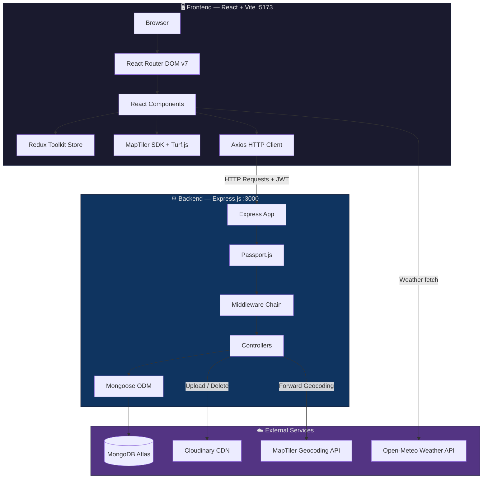

---

## 2. Frontend — Routing & Component Tree

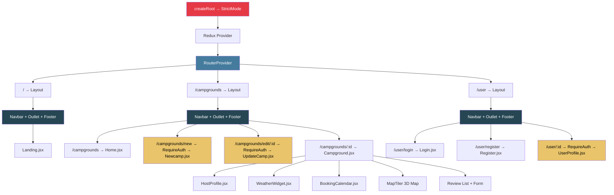

> [!NOTE]
> Yellow nodes require authentication — they are wrapped by `RequireAuth`, which checks Redux state + `localStorage` for a JWT token. If absent, user is redirected to `/user/login`.

---

## 3. Backend — File Structure Map

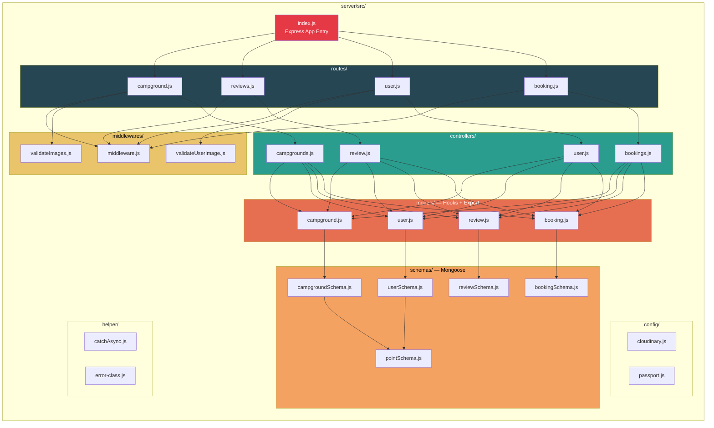

---

## 4. Backend — Complete Request Lifecycle

Every HTTP request passes through the following pipeline:

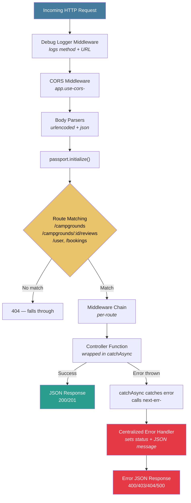

---

## 5. Route → Middleware → Controller — Per Endpoint

### 5a. Campground Routes

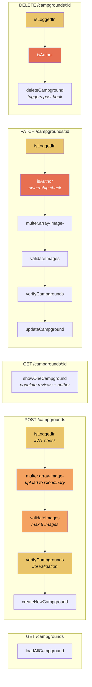

### 5b. Review Routes

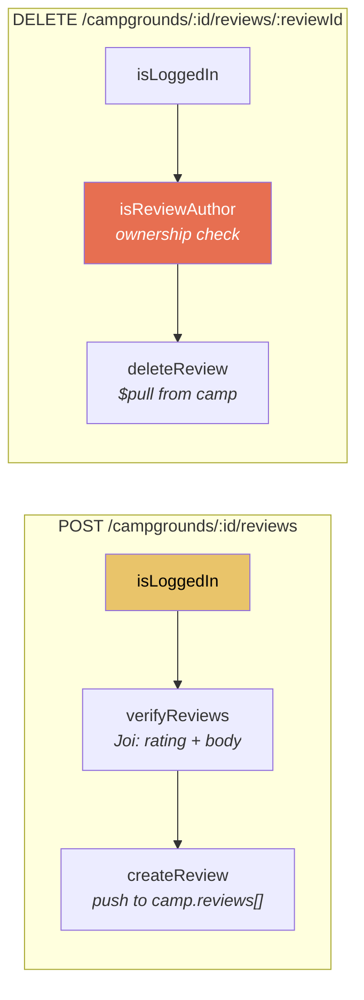

### 5c. User Routes

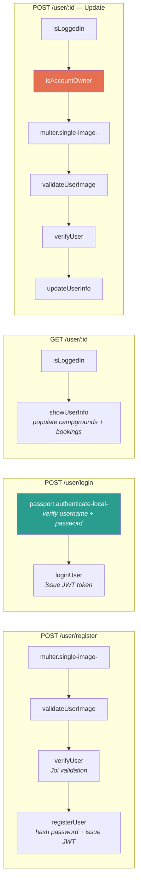

### 5d. Booking Routes

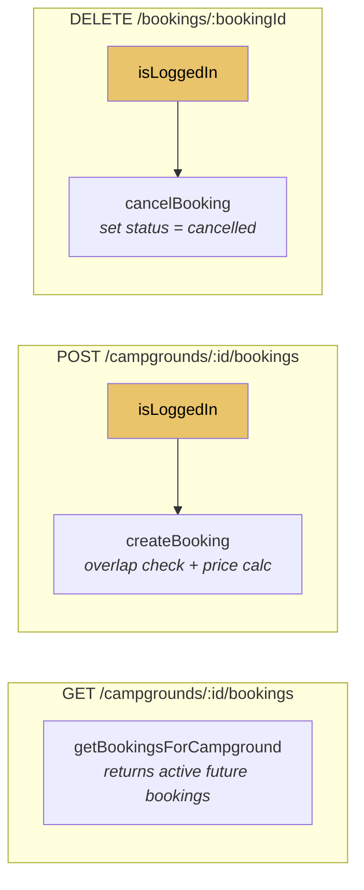

---

## 6. Authentication Flow

### 6a. Registration

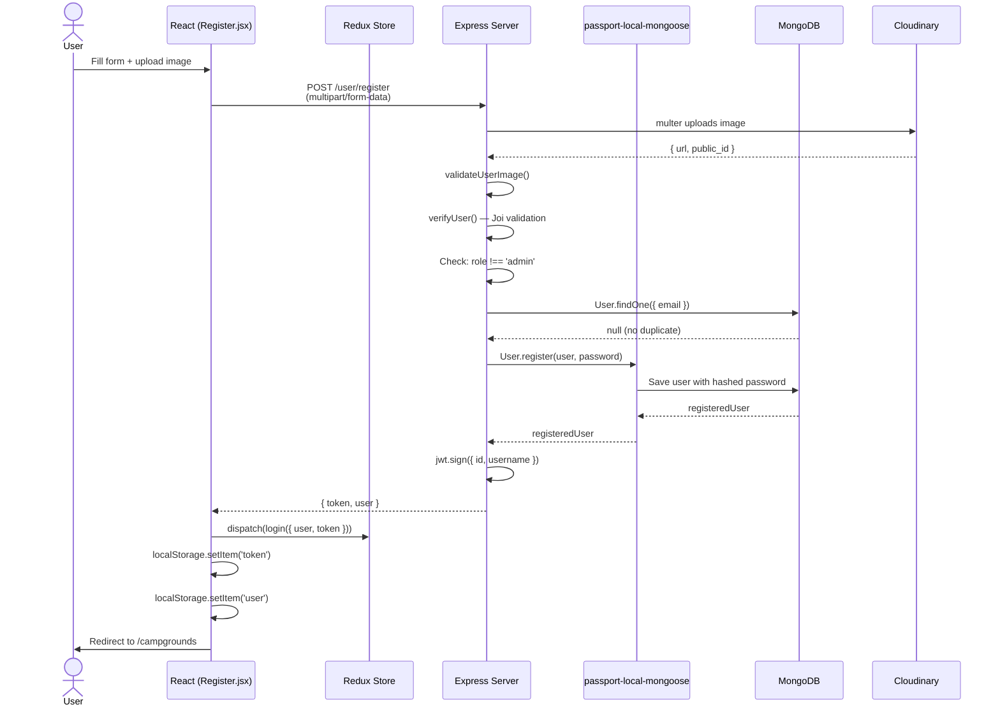

### 6b. Login

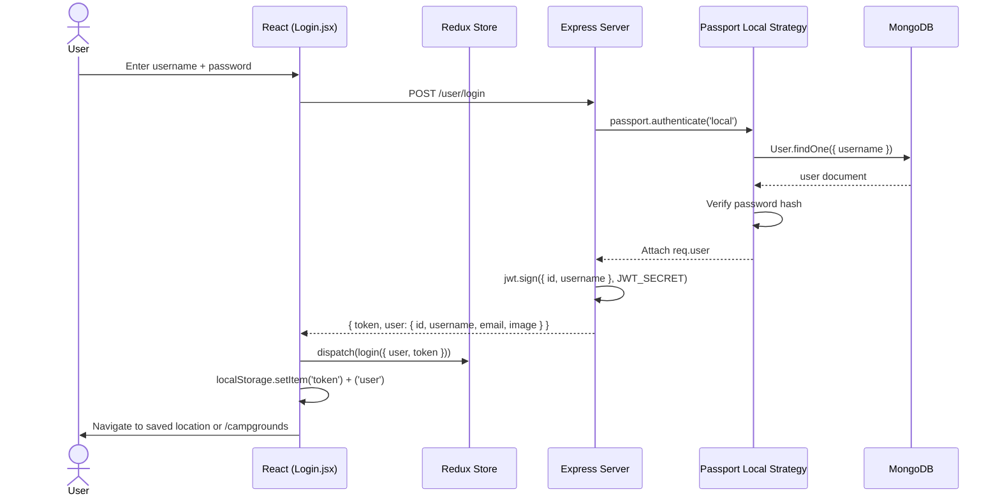

### 6c. JWT Authentication on Protected Routes

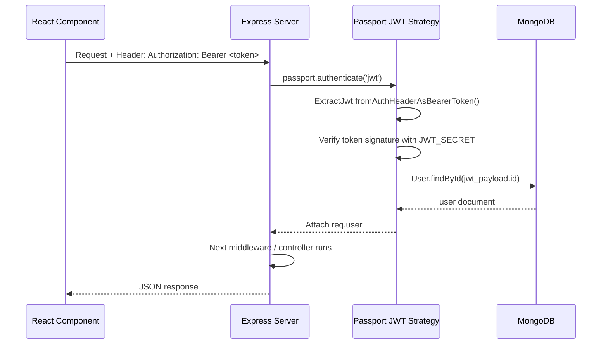

### 6d. Session Rehydration on Page Refresh

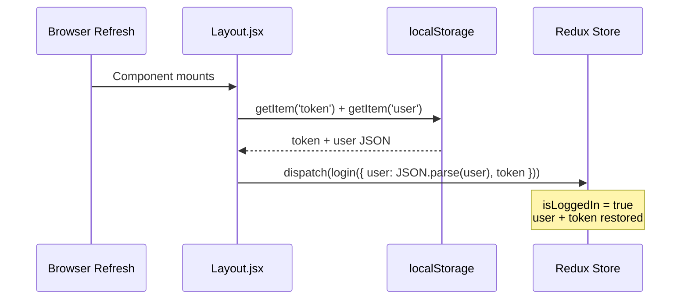

---

## 7. Database — Entity Relationship Diagram

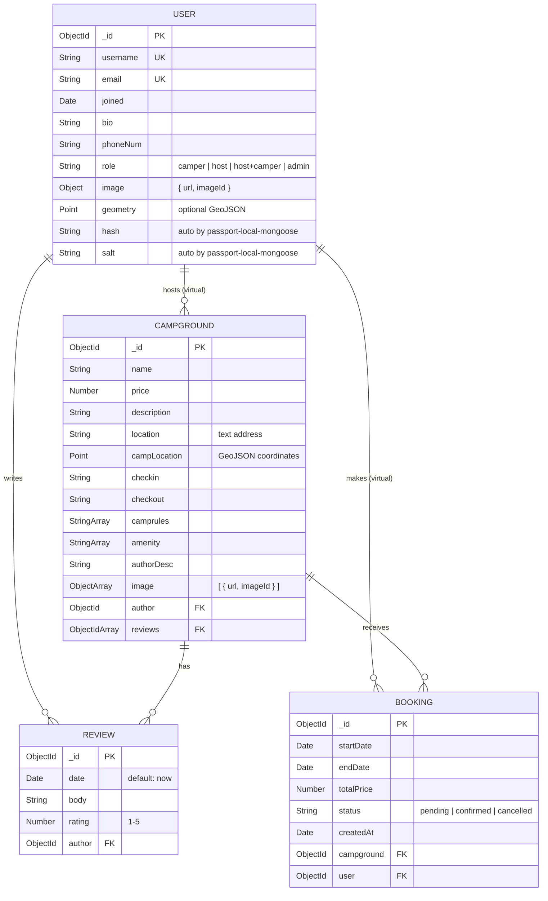

> [!NOTE]
> `campgrounds` and `bookings` on User are **Mongoose virtuals** — they don't exist as stored fields. They are computed at query-time via `localField: '_id'` → `foreignField: 'author'/'user'`.

---

## 8. Campground Creation — Full End-to-End Flow

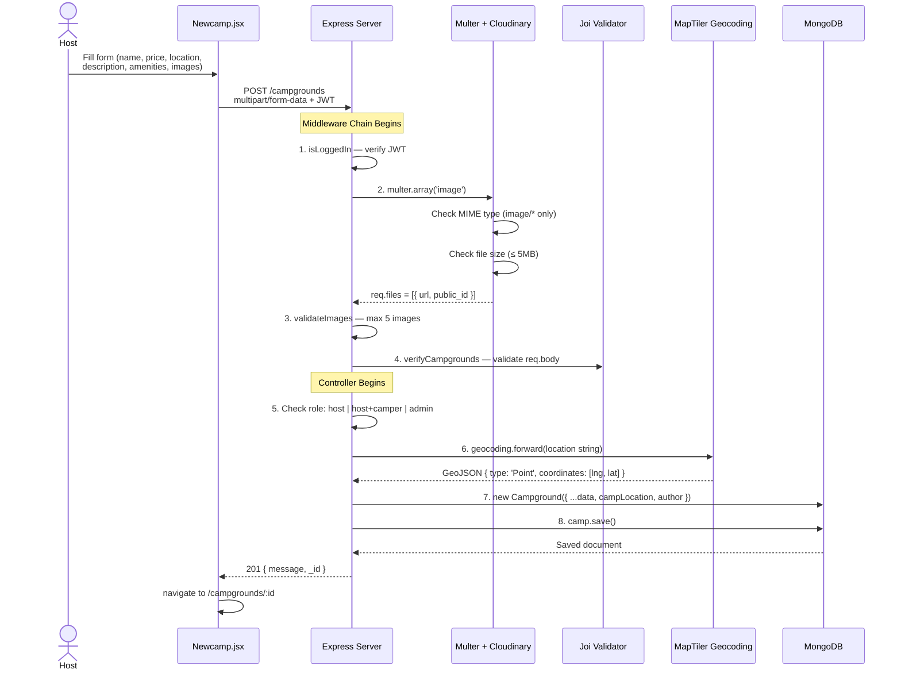

---

## 9. Campground Deletion — Cascade Flow

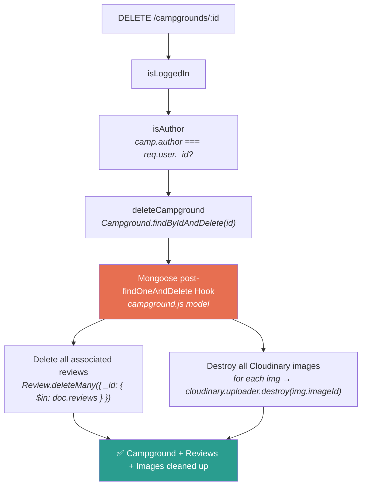

---

## 10. Booking Flow

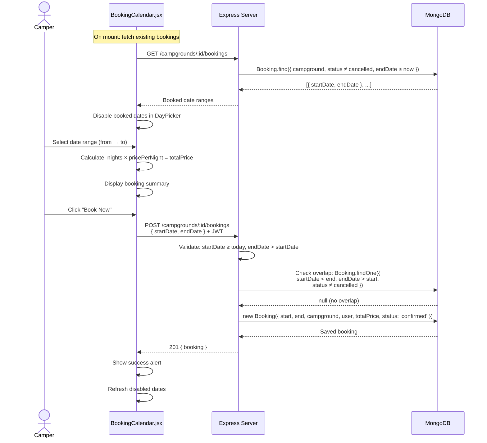

---

## 11. Review Flow

```mermaid
flowchart TD
    subgraph "Create Review"
        CR1["User submits form in Campground.jsx"]
        CR1 --> CR2["POST /campgrounds/:id/reviews<br/>{ review: { rating, body } }"]
        CR2 --> CR3["isLoggedIn"]
        CR3 --> CR4["verifyReviews — Joi validation"]
        CR4 --> CR5["createReview controller"]
        CR5 --> CR6["Find Campground by ID"]
        CR6 --> CR7["new Review({ rating, body, author: req.user._id })"]
        CR7 --> CR8["campground.reviews.push(review)"]
        CR8 --> CR9["review.save() + campground.save()"]
        CR9 --> CR10["review.populate-author-"]
        CR10 --> CR11["201 → re-fetch campground → update UI"]
    end

    subgraph "Delete Review"
        DR1["User clicks trash icon"]
        DR1 --> DR2["DELETE /campgrounds/:id/reviews/:reviewId"]
        DR2 --> DR3["isLoggedIn"]
        DR3 --> DR4["isReviewAuthor<br/><i>review.author === req.user._id?</i>"]
        DR4 --> DR5["Campground.findByIdAndUpdate<br/><i>$pull review from array</i>"]
        DR5 --> DR6["Review.findByIdAndDelete"]
        DR6 --> DR7["200 → re-fetch campground → update UI"]
    end

    style CR3 fill:#e9c46a,color:black
    style CR4 fill:#e9c46a,color:black
    style DR4 fill:#e76f51,color:white
```

---

## 12. Image Upload Pipeline

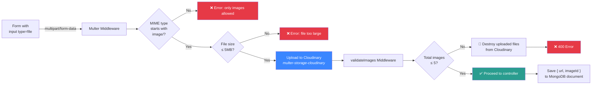

---

## 13. Redux State Management

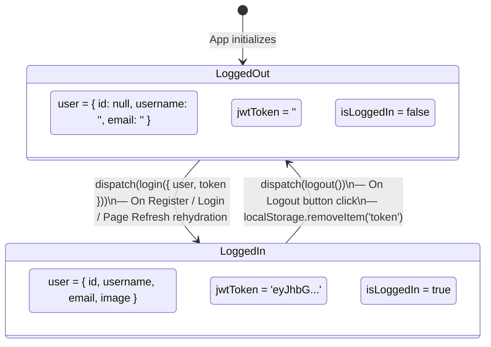

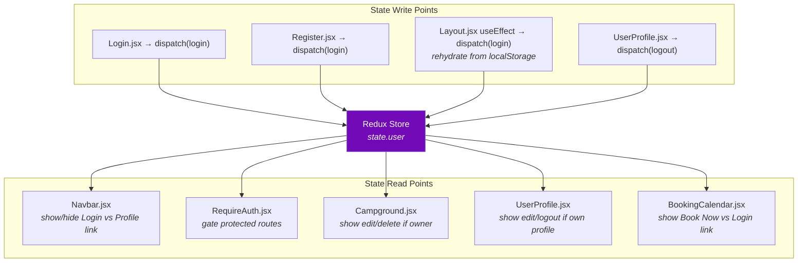

---

## 14. Middleware Function Reference

```mermaid
flowchart TD
    subgraph "Authentication Middlewares"
        ISLOGGEDIN["isLoggedIn<br/><i>passport.authenticate('jwt', { session: false })</i><br/>Extracts JWT from Authorization header<br/>Attaches user to req.user"]
    end

    subgraph "Authorization Middlewares"
        ISAUTHOR["isAuthor<br/><i>Campground.findById(id)</i><br/><i>camp.author.equals(req.user._id)?</i><br/>→ 403 if not owner"]
        ISREVIEWAUTHOR["isReviewAuthor<br/><i>Review.findById(reviewId)</i><br/><i>review.author.equals(req.user._id)?</i><br/>→ 403 if not owner"]
        ISACCOUNTOWNER["isAccountOwner<br/><i>User.findById(id)</i><br/><i>user._id.equals(req.user._id)?</i><br/>→ 403 if not owner"]
    end

    subgraph "Validation Middlewares"
        VERIFYCAMP["verifyCampgrounds<br/><i>Joi schema validation on req.body</i><br/><i>Normalizes camprules to array</i>"]
        VERIFYREVIEW["verifyReviews<br/><i>Joi schema validation on req.body.review</i>"]
        VERIFYUSER["verifyUser<br/><i>Joi schema validation on req.body</i><br/><i>Default role = 'camper'</i>"]
    end

    subgraph "File Upload Middlewares"
        MULTER_ARR["multer.array('image')<br/><i>Multi-file upload to Cloudinary</i><br/><i>5MB limit, image/* only</i>"]
        MULTER_SINGLE["multer.single('image')<br/><i>Single file upload to Cloudinary</i>"]
        VALIMG["validateImages<br/><i>POST: max 5 new images</i><br/><i>PATCH: current - deleted + new ≤ 5</i>"]
        VALUIMG["validateUserImage<br/><i>Single user profile image validation</i>"]
    end

    style ISLOGGEDIN fill:#e9c46a,color:black
    style ISAUTHOR fill:#e76f51,color:white
    style ISREVIEWAUTHOR fill:#e76f51,color:white
    style ISACCOUNTOWNER fill:#e76f51,color:white
    style VERIFYCAMP fill:#2a9d8f,color:white
    style VERIFYREVIEW fill:#2a9d8f,color:white
    style VERIFYUSER fill:#2a9d8f,color:white
    style MULTER_ARR fill:#3a86ff,color:white
    style MULTER_SINGLE fill:#3a86ff,color:white
```

---

## 15. Map & Geospatial Flow (Campground Detail Page)

```mermaid
flowchart TD
    MOUNT["Campground.jsx mounts"] --> FETCH["Fetch campground data<br/><i>GET /campgrounds/:id</i>"]
    FETCH --> INIT_MAP["Initialize MapTiler Map<br/><i>globe projection, HYBRID style</i><br/><i>terrain exaggeration 1.5x</i><br/><i>milkyway-bright background</i>"]
    INIT_MAP --> MARKER["Place Marker at<br/>camp.campLocation.coordinates"]
    INIT_MAP --> ADD_SOURCE["Add empty 'route' GeoJSON source<br/>+ dashed line layer"]

    INIT_MAP --> GEO["navigator.geolocation<br/>.getCurrentPosition()"]
    GEO --> USER_MARKER["Place User Marker<br/>at user's coordinates"]
    GEO --> CALC_DIST["Turf.js distance()<br/><i>user → campground</i><br/><i>in kilometers</i>"]
    CALC_DIST --> BADGE1["Display: '12.5 km away'"]

    INIT_MAP --> CLICK["User clicks anywhere on map"]
    CLICK --> CLICK_MARKER["Place red Marker<br/>at clicked coordinates"]
    CLICK --> CALC_CLICK["Turf.js distance()<br/><i>campground → clicked point</i>"]
    CALC_CLICK --> BADGE2["Display: 'Selected: 8.3 km'"]
    CLICK --> DRAW_LINE["Update route source<br/><i>turf.lineString<br/>campground → clicked point</i>"]

    MOUNT --> WEATHER["WeatherWidget fetches<br/><i>Open-Meteo API</i><br/><i>using camp coordinates</i>"]

    style INIT_MAP fill:#3a86ff,color:white
    style GEO fill:#2a9d8f,color:white
    style WEATHER fill:#e9c46a,color:black
```

---

## 16. Role-Based Access Control Matrix

```mermaid
flowchart TD
    subgraph ROLES["User Roles"]
        CAMPER["🏕️ Camper"]
        HOST["🏠 Host"]
        HOSTCAMPER["🏕️🏠 Host + Camper"]
        ADMIN["👑 Admin"]
    end

    subgraph ACTIONS["Available Actions"]
        BROWSE["Browse campgrounds"]
        BOOK["Book campgrounds"]
        REVIEW["Write reviews"]
        CREATE["Create campgrounds"]
        EDIT["Edit own campgrounds"]
        DELETE["Delete own campgrounds"]
        MANAGE["Manage all content"]
    end

    CAMPER --> BROWSE & BOOK & REVIEW
    HOST --> BROWSE & CREATE & EDIT & DELETE
    HOSTCAMPER --> BROWSE & BOOK & REVIEW & CREATE & EDIT & DELETE
    ADMIN --> BROWSE & BOOK & REVIEW & CREATE & EDIT & DELETE & MANAGE

    style CAMPER fill:#2a9d8f,color:white
    style HOST fill:#e9c46a,color:black
    style HOSTCAMPER fill:#f4a261,color:black
    style ADMIN fill:#e63946,color:white
```

> [!IMPORTANT]
> The `admin` role is enforced at registration (cannot self-assign) but currently has **no special admin-only functionality** beyond what `host+camper` can do. The `MANAGE` action exists in concept but has no routes or UI.
